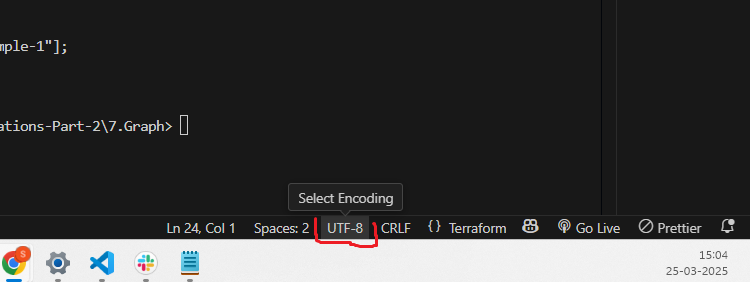

# Terraform-Graph

We have to write the terraform code in visual studio.

**To get the graph online:**

terraform init

terraform graph. 

Now, we get some output starts with digraph, then we have to copy this code. Open  “ **graphviz** **online**” in google chrome and paste this code in that online terminal. So we can see the graph on the right side.    

Disadvantages: The main disadvantage in real-world in organizations is, if we give the code in online tools, it might be security issues. There might be a chance, that we leak our infrastructure structure details. So in this case, we can download graphwiz software in our local pc or in our EC2 machine.

======================

**Download:**

We can download grapgwiz software from the following link:

[https://graphviz.org/download/](https://graphviz.org/download/)

or we can just simple search “ **graphviz** “ in google search, so we can open  the first link.

======================

**In linux: (Ubuntu EC2 instance)**

1. Create ubuntu linux EC2 instance.
2. Install Terraform
3. Inorder, to check the OS and version:  **cat /etc/os-release**
4. run **dot   —→**  we get error, as we didn’t yet install the software.
5. Install the graphviz software for ubuntu linux.

**sudo apt install graphviz**

1. run **dot** ( Again to check it’s working)  —> no errors now, as we installed the software.
2. Run terraform init
3. terraform graph
4. terraform graph | dot -Tsvg > graph.svg  to get the output  in linux server to a file.
5. cat graph.svg  —> open this file.
6. copy all this code. In our local pc in VS code, create a file, for.ex: graph.svg and paste the contents here and save it.
7. Go to this file in our folder in our pc and right click -> open with -> Google chrome --> we can see the output graph.

**In Windows:**

========

1.Install software with:

graphviz-12.2.1 (64-bit) EXE installer [sha256] from [https://graphviz.org/download/](https://graphviz.org/download/)

2.Under System Variables, find Path and select it.

3.Click Edit

4.Click New and add this value:

C:\Program Files\Graphviz\bin

1. In out terminal:

```
history:
    dot -V
    terraform graph > graph.dot
    dot -Tpng graph.dot -o graph.png
    we can open this .png file and see the graph.
    For better zooming and clarity, generate an SVG: 
    dot -Tsvg graph.dot -o graph.svg
    open this and see the image.
```

If it doesn’t work, change Encoding in VS code bottom right corner.



we should have UTF-8 here, otherwise click on this and click on save Encoding and change it to UTF-8, then it will work.

==========================================